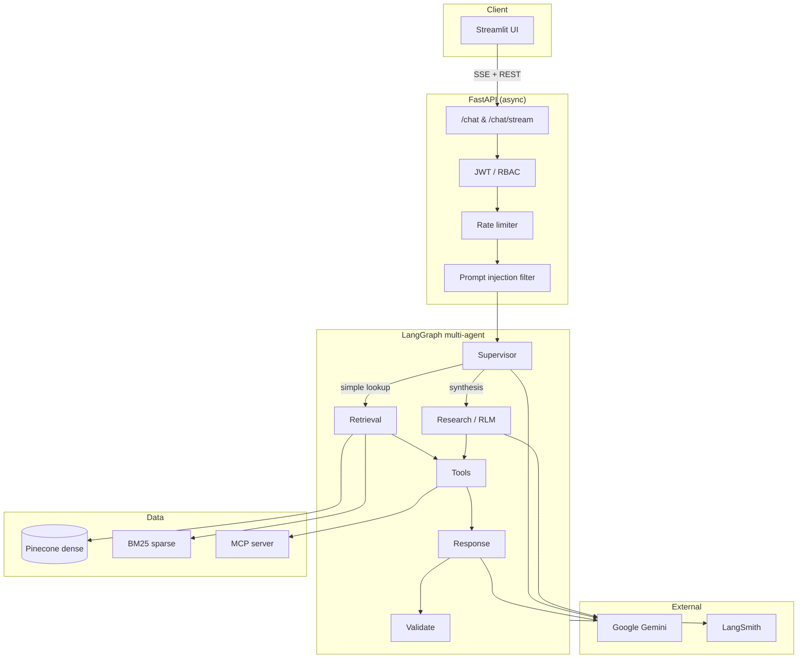
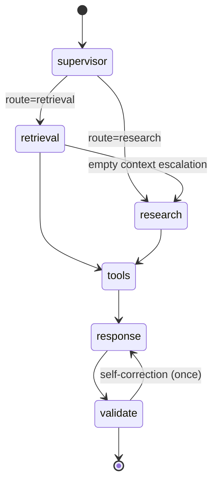
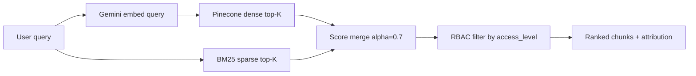
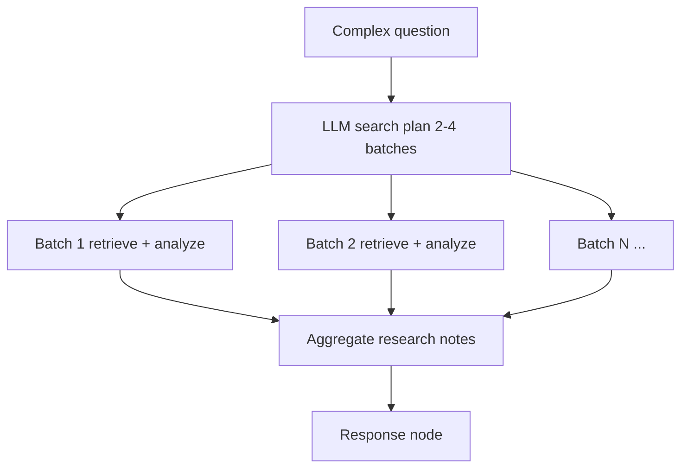
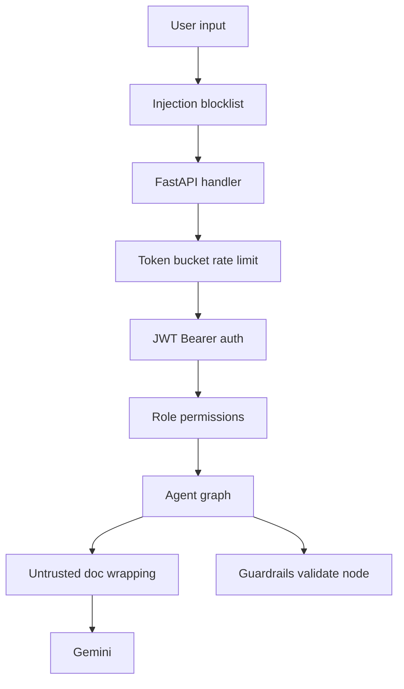

# Architecture — Commercial Bank Enterprise AI Assistant

## System overview

The assistant is a **multi-agent RAG platform** for internal bank knowledge: incidents, runbooks, policies, architecture docs, and meeting notes. Users interact via a **Streamlit** chat UI; the **FastAPI** backend orchestrates a **LangGraph** agent pipeline with hybrid retrieval, tools, MCP lookups, guardrails, and **LangSmith** tracing.



## Agent graph

Every chat request runs through a compiled LangGraph workflow:



Collaboration details (shared state, failure chains, butterfly-effect containment): [multi-agent-collaboration.md](multi-agent-collaboration.md).

**Container deployment:** `docker compose up --build` — see root [docker-compose.yml](../docker-compose.yml) and [README](../README.md#7-run-with-docker-compose-bonus).

| Node | Responsibility |
|------|----------------|
| **supervisor** | Classify intent; route to direct retrieval or multi-doc research |
| **retrieval** | Hybrid RAG via `knowledge_search` tool |
| **research** | RLM batch decomposition: plan → batch retrieve → analyze → aggregate |
| **tools** | Optional `python_analysis` (pandas) and MCP lookups (analyst+) |
| **response** | LLM answer with citations; streams tokens on `/chat/stream` |
| **validate** | Citation check, brand safety, unauthorized tool audit |

Implementation: `backend/app/agents/graph.py`, `backend/app/agents/nodes.py`.

## Hybrid retrieval



- **Dense**: Pinecone namespaces per document folder (`incidents/`, `runbooks/`, …)
- **Sparse**: In-process BM25 over `data/processed/bm25_corpus.json`
- **RBAC**: `viewer`/`analyst` see internal docs; `admin` also sees `restricted`
- **Fallback**: If Pinecone fails, sparse-only search continues (degraded mode)

Implementation: `backend/app/retrieval/hybrid_search.py`.

## RLM (research route)

Complex queries (summarize, compare, trends, “all incidents”) trigger the **research** node:



Events emitted: `rlm_plan_created`, `rlm_batch_*`, `rlm_aggregation_complete`.

Implementation: `backend/app/agents/rlm.py`.

## Security architecture



| Control | Location |
|---------|----------|
| Prompt injection blocklist | `backend/app/security/prompt_injection.py` |
| JWT login | `backend/app/api/routes/auth.py` |
| RBAC (roles + tools + docs) | `backend/app/security/rbac.py` |
| Rate limiting | `backend/app/security/rate_limit.py` |
| Tool arg validation | `backend/app/security/tool_validation.py` |
| Output guardrails | `backend/app/security/guardrails.py` |

### Role matrix

| Role | Chat / search | Research route | Tools / MCP | Restricted docs |
|------|---------------|----------------|-------------|-----------------|
| viewer | Yes | No | No | No |
| analyst | Yes | Yes | Yes | No |
| admin | Yes | Yes | Yes | Yes |

## Streaming & observability

**SSE endpoint** `POST /api/v1/chat/stream` emits:

| Event | Content |
|-------|---------|
| `started` | `session_id`, `request_id` |
| `node` | Graph node completion |
| `agent_event` | Routing, retrieval, tools, RLM, validation |
| `token` | LLM text chunk |
| `done` | Full `ChatResponse` payload |

**LangSmith** traces LLM calls, retrieval, and agent runs when `LANGSMITH_TRACING=true`.

Implementation: `backend/app/agents/stream_runner.py`, `backend/app/observability/langsmith_config.py`.

## Session memory

Per-`session_id` in-process store retains the last N turn pairs for follow-up questions. See [memory-design.md](./memory-design.md).

## MCP integration

In-process MCP server exposes dummy enterprise data:

- `lookup_employee` — directory search
- `lookup_service` — service catalog / owners
- `lookup_incident` — incident records

Implementation: `mcp_server/server.py`, `backend/app/tools/mcp_client.py`.

## Project layout

```
enterprise-ai-assistant/
├── backend/app/
│   ├── agents/          # LangGraph nodes, RLM, streaming
│   ├── api/routes/      # REST + SSE endpoints
│   ├── core/            # Config, async utils, fallbacks
│   ├── llm/             # Gemini provider factory
│   ├── memory/          # Session store
│   ├── retrieval/       # Hybrid dense + BM25
│   ├── security/        # Auth, RBAC, guardrails
│   └── tools/           # knowledge_search, python_analysis, MCP
├── frontend/            # Streamlit UI + API client
├── mcp_server/          # Enterprise MCP data server
├── scripts/             # Ingestion, tests, mock data
├── data/mock_documents/ # 41 Commercial Bank docs
└── docs/                # Architecture & design
```

## Production evolution (not in POC)

| Area | POC | Production target |
|------|-----|-------------------|
| Auth | Hardcoded users + JWT | SSO / OIDC |
| Memory | In-process dict | Redis with TTL |
| BM25 | Local JSON file | OpenSearch / Elasticsearch |
| Rate limit | In-process bucket | Redis / API gateway |
| MCP | In-process | Sidecar MCP server |
| Deployment | Local uvicorn | K8s + ingress + WAF |

## Demo queries

| Query | Expected behavior |
|-------|-------------------|
| "What is the password reset policy?" | Retrieval route, policy citations |
| "Summarize payment failure outages last year" | Research / RLM, multiple incident batches |
| "Who owns the payments service?" | Analyst+: MCP `lookup_service` |
| "How many payment incidents by department?" | Analyst+: `python_analysis` tool |
