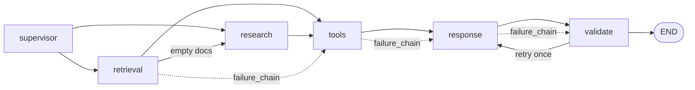

# Multi-Agent Collaboration (Step S Bonus)

How agents **share state**, **hand off work**, **contain failures**, and avoid the **butterfly effect** (small upstream errors cascading into bad downstream answers).

## Design principle

Agents do not chat with each other directly. They collaborate through a **shared `AgentState`** (LangGraph `TypedDict`):

- Each node reads upstream fields (`retrieved_docs`, `research_notes`, `failure_chain`, …).
- Each node returns a **partial update** merged by LangGraph reducers.
- **Handoff notes** document what one agent passed to the next.
- **Failure chain** records upstream errors so downstream agents can adapt.

Implementation: `backend/app/agents/collaboration.py`

## State management

### Core fields

| Field | Type | Purpose |
|-------|------|---------|
| `node_status` | `dict[str, str]` | Per-node outcome: `ok`, `degraded`, `failed`, `skipped` |
| `failure_chain` | list (append) | Ordered upstream failures with downstream impact |
| `handoff_notes` | list (append) | Structured agent → agent summaries |
| `degraded_mode` | `bool` | True when any recoverable failure occurred |
| `degraded_reasons` | list (append) | Human-readable degradation causes |
| `butterfly_impact` | `dict` | Severity + containment recommendations |
| `retrieval_escalated` | `bool` | Prevents infinite retrieval → research loops |
| `correction_attempts` | `int` | Validation-driven response retries (max 1) |
| `retry_response` | `bool` | Router flag for validate → response loop |

### Reducers

List fields use `operator.add` so multiple nodes append without overwriting:

```python
failure_chain: Annotated[list[dict], operator.add]
handoff_notes: Annotated[list[dict], operator.add]
agent_events: Annotated[list[dict], operator.add]
```

`node_status` is a dict merged key-by-key in the streaming runner.

## Agent handoffs

Every major node writes a handoff before the next agent runs:

```
supervisor → retrieval|research
retrieval  → tools|research (escalation)
research   → tools
tools      → response
response   → validate
validate   → response (correction) | END
```

Example handoff stored in state:

```json
{
  "from": "retrieval",
  "to": "research",
  "summary": "Retrieval produced no usable documents; escalating to RLM research pipeline.",
  "context": {"doc_count": 0}
}
```

The **response** agent receives handoffs in its prompt via `format_handoffs_for_prompt()`.

## Failure handling by node

| Node | Failure | Containment |
|------|---------|-------------|
| **supervisor** | LLM routing fails | Heuristic regex routing + RBAC downgrade |
| **retrieval** | Search timeout/error | Empty docs + `failure_chain`; may **escalate to research** |
| **research** | RLM pipeline error | Empty research context + failure recorded |
| **tools** | Timeout/exception | **Circuit breaker**: skip tools if no retrieval context; sanitize errors out of prompt |
| **response** | LLM unavailable | Retrieval-only fallback answer |
| **validate** | Guardrail issues | One **self-correction** retry to response with issue list |

## Butterfly effect

A small upstream failure can silently poison a good-looking answer:

```
retrieval fails → empty context
    → tools run on nothing → error JSON in prompt
        → LLM misreads errors as data
            → validate flags citations → user still gets weak answer
```

### Containment strategies

1. **Failure chain + impact assessment** — `assess_butterfly_effect()` computes severity and recommended actions.
2. **Retrieval escalation** — empty/failed retrieval routes to **research** once (analyst/admin).
3. **Tool circuit breaker** — `should_skip_tools()` prevents MCP/analysis when context is missing.
4. **Prompt sanitization** — `sanitize_tool_output_for_prompt()` strips error JSON before synthesis.
5. **Degraded mode banner** — response LLM is told to answer conservatively.
6. **Validation loop** — one correction attempt with explicit issue list (not just a footnote).

### Cascade graph



## Graph routing (updated)

```text
START → supervisor → retrieval|research
retrieval → research (escalation) | tools    ← NEW conditional
research → tools
tools → response
response → validate
validate → response (correction) | END       ← NEW conditional
```

File: `backend/app/agents/graph.py`

## Observability

Collaboration events appear in `agent_events` with `node: "collaboration"`:

| event_type | Meaning |
|------------|---------|
| `handoff` | Agent passed work downstream |
| `failure_recorded` | Upstream failure logged |
| `butterfly_effect` | High-severity cascade detected |
| `retrieval_escalation` | Empty retrieval → research |
| `validation_correction` | Validate requested response retry |

API / SSE responses include:

- `degraded_mode`
- `failure_count`
- `handoff_count`
- `butterfly_severity`

Streamlit activity panel shows **collaboration** events and degraded mode.

## Test

```bash
python scripts/test_multi_agent_collaboration.py
```

## Production extensions

| POC | Production |
|-----|------------|
| In-memory state per request | Redis checkpointing + replay failed node only |
| Heuristic escalation | Supervisor re-entry with failure-aware plan |
| Max 1 validation retry | Bounded retry with human approval |
| Circuit breaker per request | Global health-aware routing (skip Pinecone when down) |
